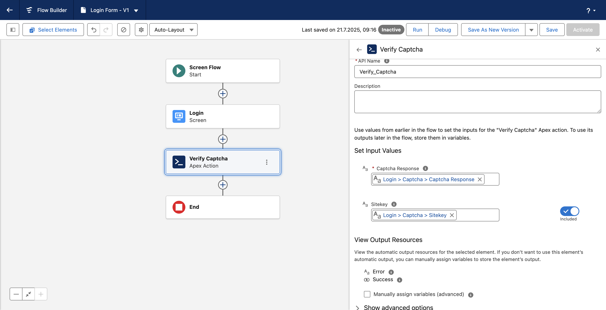
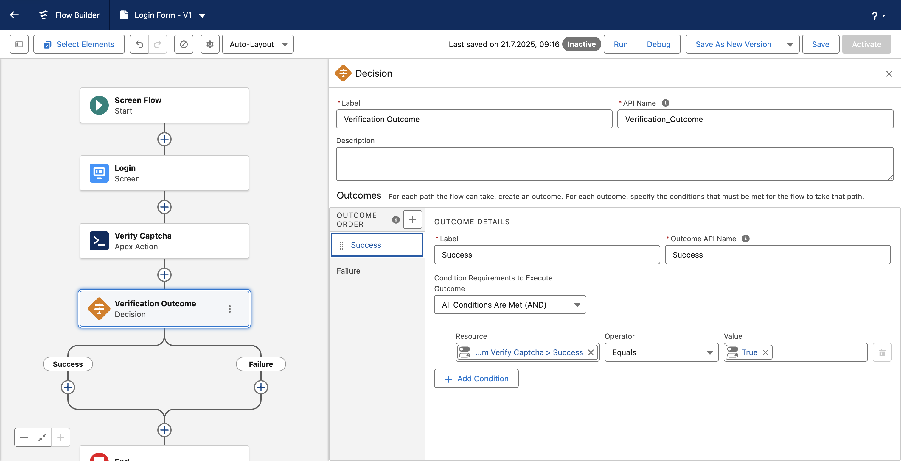
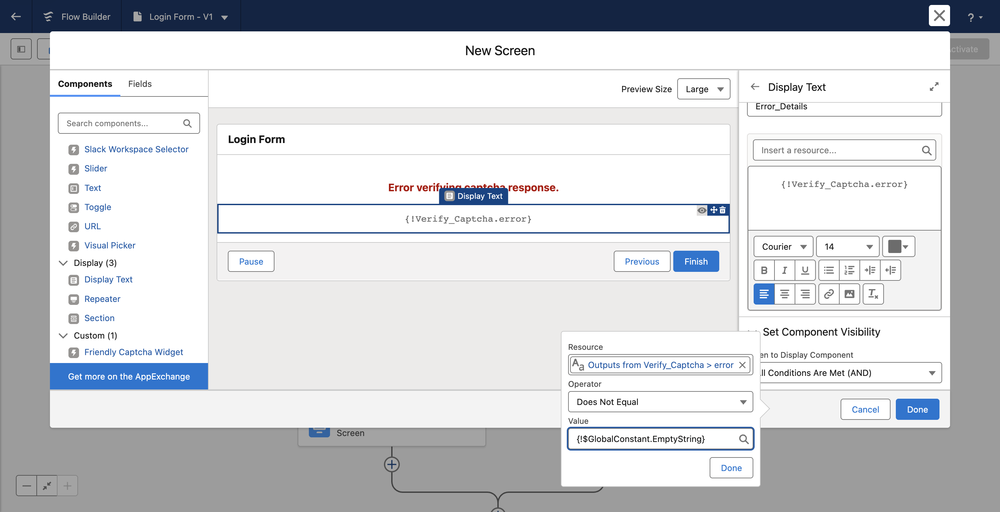

# Friendly Captcha for Salesforce

This package provides building blocks for integrating [Friendly Captcha][fc] with your
Salesforce environment. Friendly Captcha is a service that protects websites from bots
and abuse in a privacy-friendly and accessible way.

Integrating Friendly Captcha involves a front-end component and a back-end component.
We recommend familiarizing yourself with the [Friendly Captcha documentation][fcdocs]
to develop a baseline understanding of how an integration works.

For the front-end component of the integration, this package provides a Lightning Web
Component (LWC). If you're using Visualforce, you should also be able to simply insert
[the standard markup][html] for the front-end integration.

For the back-end component of the integration, this package provides an Apex class that
performs an HTTP request to the Friendly Captcha site verification API.

## Configuration

Both the Apex class and the LWC will pull configuration parameters from a
Custom Metadata Type (CMDT) that ships with this package. You can configure your
integration by setting values for the fields in the provided CMDT record. However,
both provide an alternative method of configuration (detailed below).

1. Navigate to your organization's Setup.
2. Search for Custom Metadata Types.
3. In the list, find the CMDT with the label "Config" and the namespace "friendlycaptcha".
4. Click "Manage Records".
5. Edit the recorded listed with the label "Settings".

You'll find 8 fields that you can set. `Sitekey` and `APIEndpoint` are referenced by both
the LWC and the Apex class. The fields under the **Verification Settings** heading are
used by the Apex class only. The fields under the **Widget Settings** heading are used by
the LWC only.

At a minimum, you'll need to provide values for `Sitekey` and `APIKey`. The rest of the
configuration parameters have sensible defaults. To learn more about the sitekey and API
key, we recommend reviewing the [Friendly Captcha documentation][fcdocs].

## Flows

This example shows how to use Friendly Captcha for Salesforce in a Flow. We'll create
a simple login screen that displays a Friendly Captcha Widget and includes server-side
captcha verification.

### 1. Create a new Screen Flow in Setup.

This will open the Flow Builder app with Start and End elements. Add a Screen Flow with
an Email component and a Password component, and then scroll down to the list of custom
components to add a Friendly Captcha Widget component. If you haven't configured your
integration by following the steps listed above, make sure to at least add a value for
the Sitekey field at this step.


### 2. Create an Apex Action to verify the captcha response.

Navigate to Apex Classes in Setup. Create a new Apex Class with the following content.

```
public class LoginAction {

    @InvocableMethod(label='Verify Captcha')
    public static List<Response> verify(List<Request> requests) {
        List<Response> responses = new List<Response>();

        for (Request request : requests) {
            Response response = new Response();
            friendlycaptcha.VerifyResult result = friendlycaptcha.Client.verifyCaptchaResponse(request.captchaResponse);
            response.success = result.shouldAccept();
            if (result.getErrorDetail() != null) {
                response.error += result.getErrorDetail();
            }
            responses.add(response);
        }

        return responses;
    }

    public class Request {
        @InvocableVariable(label='Captcha Response' required=true)
        public String captchaResponse;

        @InvocableVariable(label='Sitekey' required=false)
        public String sitekey;
    }

    public class Response {
        @InvocableVariable(label='Error')
        public String error = '';

        @InvocableVariable(label='Success')
        public Boolean success;
    }
}
```

This Apex Action performs a Friendly Captcha API call to verify the captcha response from the previous element in the
Flow. If Friendly Captcha is able to verify the captcha response, the `success` flag is set to true. Any errors
returned by the API are also included in the output of this Flow element.

The `friendlycaptcha.Client.verifyCaptchaResponse()` method requires an API key for authentication. We recommend
configuring the API key as outlined in the previous section. Alternatively, you can pass an options object to the
method call like this:

```
friendlycaptcha.Options opts = new friendlycaptcha.Options()
    .apiKey('<YOUR API KEY>')
    .sitekey(request.sitekey); // passing 'sitekey' is optional for the verify API call
friendlycaptcha.VerifyResult result = friendlycaptcha.Client.verifyCaptchaResponse(request.captchaResponse, opts);
```

You could perform other kinds of validation (for example on the email and password) in this action as well.
Save the Apex class and return to your Screen Flow.

### 3. Add the "Verify Captcha" Apex Action to your Screen Flow.

It should come after the Login Screen element. Make sure to connect the "Captcha Response" (and optionally "Sitekey")
variables from the Screen element as inputs to the Apex Action element.



### 4. Add a Decision element based on the output of the Apex Action.

You can use the `success` and `error` output variables of the Apex Action to render success or failure screens.
Add a Decision element that leads to "Success" or "Failure" based on whether the `success` variable is true or
false. In this example, depending on whether the verification is successful, a different screen is presented.



You can also conditionally render the error message if it's present:



[fc]: https://friendlycaptcha.com
[fcdocs]: https://developer.friendlycaptcha.com/docs/v2/getting-started
[html]: https://developer.friendlycaptcha.com/docs/v2/getting-started/install#option-a-html-scripts
